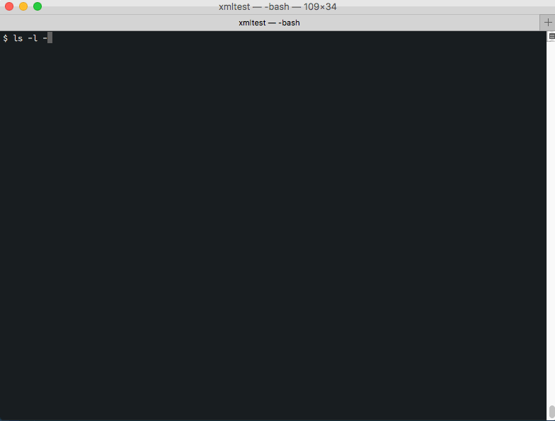

# xmlshow: A super-simple and powerful viewer for large XML files, for the command-line

## Introduction

Ever found yourself with an XML file just too large for your editor or your browser, and did you (like me) spent your time trying to find a simple solution on the Web? This one may be for you.

And if it isn't, you may have found enough material to create your own, just with standard utilities.

### Features
xmlshow is a super-simple XML viewer for the Unix command line, which should provide most everything you could wish,
since uses the features of [less](https://ss64.com/bash/less.html).

  - It will display any **large** XML file in a breeze.
  - It has syntax highlighting
  - If it is a zip file, it will unzip it in the process (zipping is *both* indispensable and effective, 
    since XML is wonderfully redundant).
  - It has line numbering
  - You can navigate forward and backward
  - You can use sed search patterns.

### Limitations
There are two things, however, that it won't do:
  - Modifying the file
  - Prepare or serve coffee

### Usage
Just type:

    $ xmlshow <filename>
    

    
## How it works
It combines:

  - unzip, to extract the file
  - file to check the mime type of the input file
  - [xmllint](http://xmlsoft.org/xmllint.html), for beautifying the XML.
  - highlight to highlight the syntax
  - [less](https://ss64.com/bash/less.html) to view the file
    
That's all there is to it: it's just a typical shell hack with Unix pipes, sufficiently long to warrant a script file, and sufficiently useful to be put on github.

## How to install it

  1. Download the .sh file an install it some directory in your path (type `echo $PATH`to find out).
  2. Make it executable: `chmod +x xmlshow.sh`
  2. In that same directory, create a soft link: `ln -s xmlshow.sh xmlshow`
  3. If it fails, make sure that utilities mentioned above (typically xmllint and highlight) are installed on your system. If not use your favorite package manager
     - On Debian, `apt get install`
     - On MacOs, `brew install` is your friend (see [instructions to install brew](https://brew.sh/))

*Voilà*, you should be all set.
 
## Tips

The [less](https://ss64.com/bash/less.html) utility has actually quite a few tricks up its sleeves.

Beside the usual commands, remember that:

 - `z`jumps one window forward
 - `w`jumps one window backward
 - **`h` calls a help, with plenty of good features you may not have suspected (use q to quit)**
 - To search for a pattern just type `/pattern`

It is also worth remembering that it is often easy to display more characters at once, either by getting a smaller font on your terminal pane (on MacOS: `CMD -`, `CMD 0` to get to normal), or by increasing the size of the window or pane!
